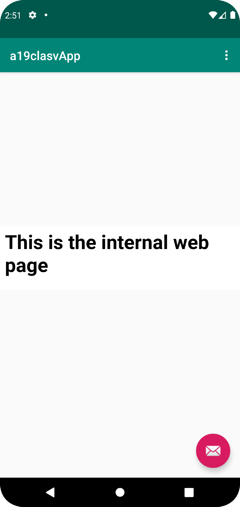

# Rapport
Ändrat namn på appen.
```
<string name="app_name">a19clasvApp</string>
```
Gett tillstånd att använda internet.
```
<uses-permission android:name="android.permission.INTERNET"/>
```
Skapat ett WebView element med ID:et "my_webview".
```
<WebView
        android:id="@+id/my_webview"
        android:layout_width="wrap_content"
        android:layout_height="wrap_content"
        android:text="Hello World!"
        app:layout_constraintBottom_toBottomOf="parent"
        app:layout_constraintLeft_toLeftOf="parent"
        app:layout_constraintRight_toRightOf="parent"
        app:layout_constraintTop_toTopOf="parent" />
```
Importerat det jag behöver för WebView och WebViewClient.
```
import android.webkit.WebView;
import android.webkit.WebViewClient;
```
Skapat en privat WebView.
```
    private WebView myWebView;
```
Satte en WebViewClient på my_webview
```
        myWebView = findViewById(R.id.my_webview);
        myWebView.setWebViewClient(new WebViewClient());
```
Aktiverade Javascript.
```
        myWebView.getSettings().setJavaScriptEnabled(true);
```
Visar den yttre hemsidan https://www.his.se/ i showExternalWebPage().
```
    public void showExternalWebPage(){
        myWebView.loadUrl("https://www.his.se/");
    }
```
Headern "This is the internal web page" i about.html.
```
<html>
<body>
<h1>This is the internal web page</h1>
</body>
</html>
```
Visar den inre hemsidan about.html i showInternalWebPage().
```
    public void showInternalWebPage(){
        myWebView.loadUrl("file:///android_asset/about.html");
    }
```
Kallar på showExternalWebPage() om du väljer "External Web Page".
```
        if (id == R.id.action_external_web) {
            showExternalWebPage();
            return true;
        }
```
Kallar på showInternalWebPage() om du väljer "Internal Web Page".
```
        if (id == R.id.action_internal_web) {
            showInternalWebPage();
            return true;
        }
```
Den yttre webbsidan:

Den inre webbsidan:

